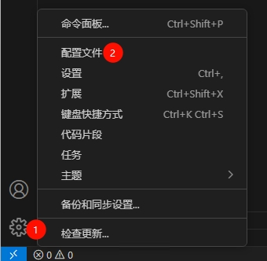
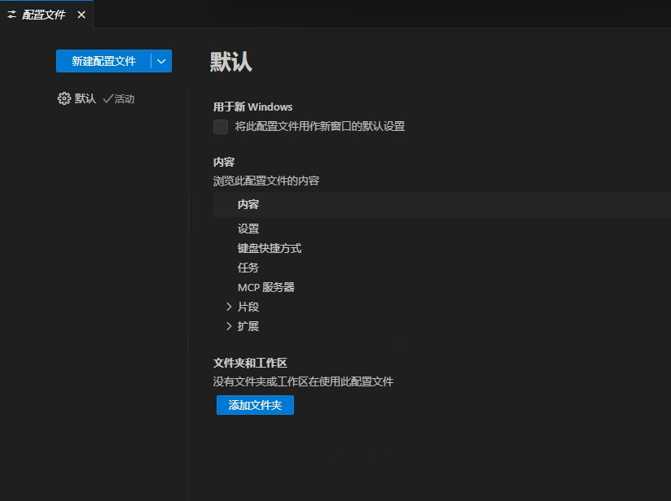
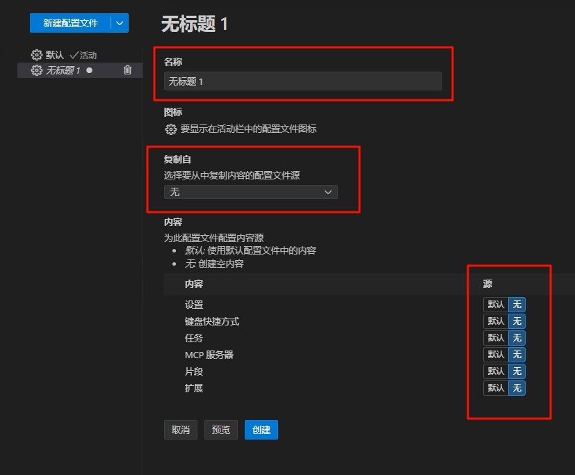
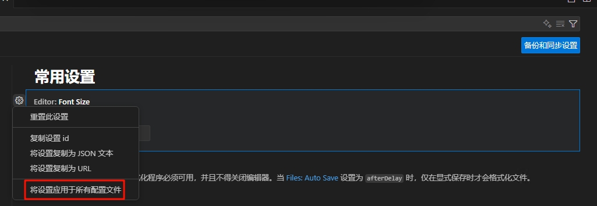

# VScode安装及初步配置

## 下载安装及个性化

关于这一部分，大家可以阅读[这篇文章](https://blog.csdn.net/msdcp/article/details/127033151)，开头部分对安装过程和个性化配置做了很好的介绍。vscode的字号，颜色主题，图标主题，快捷键，页面布局，等都可以根据个人喜好进行调整，这部分就交给有兴趣的读者自行探索。文章后半部分的插件推荐部分则与我们的需求关系不大，可以自行决定是否阅读。

## 插件管理

vscode的强大之处在于其丰富的插件生态系统。我们可以通过安装不同的插件来扩展vscode的功能，以满足不同的开发需求。  
然而，插件过多会导致vscode启动变慢，占用更多的系统资源。因此，我们我们需要将插件进行分类管理，在不同的项目中启用不同的插件，以保持vscode的高效运行。

点击左下角的设置图标，我们可以看到配置文件选项：

可以看到左边还只有一个默认的配置文件，我们可以点击新建配置文件：

我们关注三个部分，首先是`名称`，可以设置为“python”、“matlab”等以便区分。`复制自`选项则可以选择一个已有的配置文件作为基础进行选择性的复制，选中后下方的`源`将多出一个`*（复制）`的选项，可以在配置相近环境时使用。最后的`源`选项，在选择`默认`时将与默认配置文件共用同一个配置，`无`则是创建独立的空配置，`复制`则是独立的副本。

在创建新配置时，我们的目的就是分别管理扩展（插件），因此至少`扩展`项要选择`无`以外的选项。

而对于一些各个环境都用到的插件，我们也可以方便的进行管理，这里以markdown的相关插件为例。markdown是一种标记文本格式，常被开发者们用来编写文档（例如本文）。  
这里选择安装负责主要功能的`Markdown All in One`和提供语法检查的`markdownlint`。在扩展管理页面点击扩展右下角的齿轮，再点击`将扩展应用于所有配置文件`,就可以让现在及将来创建的配置文件都安装这个扩展。

