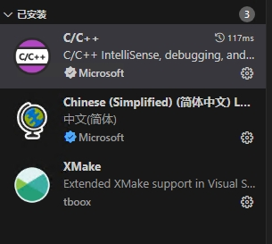
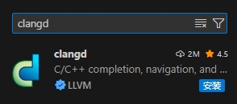
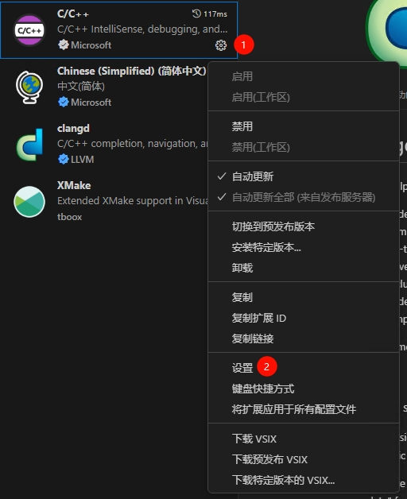
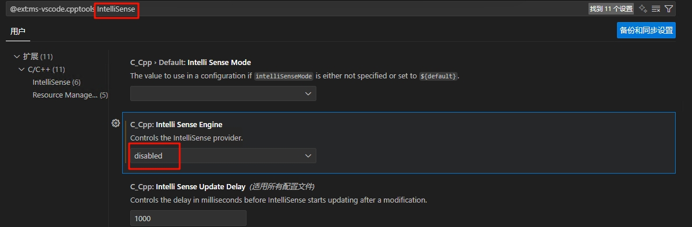
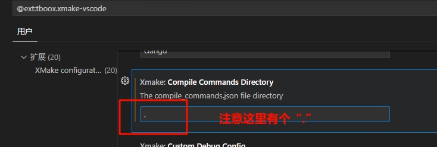
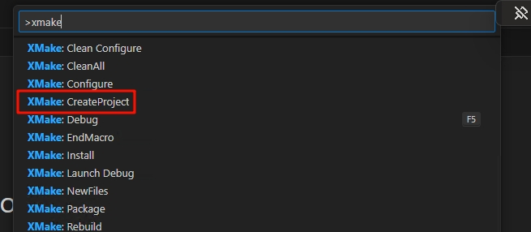
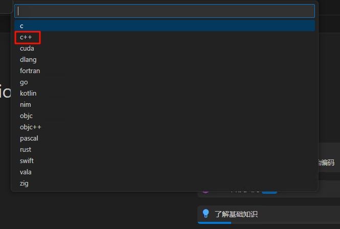
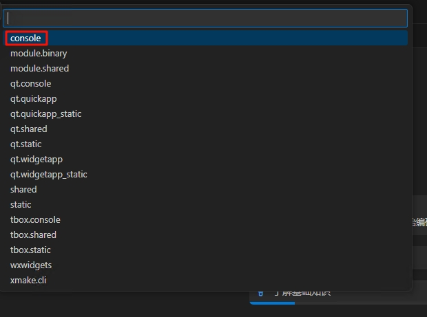
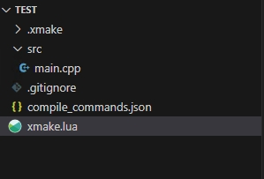
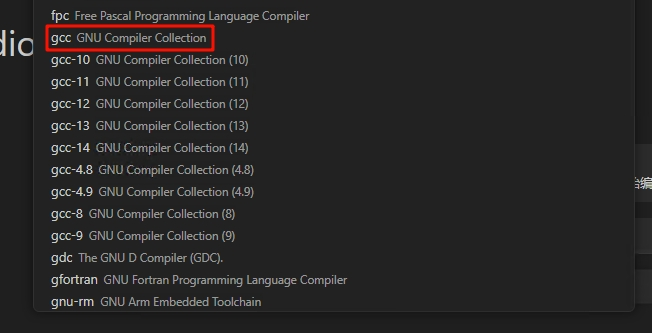

# vscode 使用xmake进行工程管理的C/C++环境配置

## 基础插件安装

我们可以首先新建一个xmake配置文件并切换，安装`C/C++`和`xmake`插件。其中`C/C++`的作用是提供语法解析高亮、代码跳转、代码调试等。`xmake`插件则是用于配合我们之前安装`xmake`工具进行工程管理。



## 使用clangd插件代替C/C++插件的IntelliSense功能（可选）

`C/C++`插件的IntelliSense功能有时会出现解析错误，导致代码跳转、补全等功能失效。我们可以使用`clangd`插件来替代它的IntelliSense功能。  
就像`xmake`插件要基于`xmake`运行一样，`clangd`也需要我们安装`clangd`才能正常运行。在MSYS2的UCRT64终端，输入以下命令安装：

```bash
pacman -Sy mingw-w64-ucrt-x86_64-clang-tools-extra
```

接下来安装`clangd`插件



因为`clangd`的IntelliSense功能会与`C/C++`的IntelliSense冲突，我们要关闭`C/C++`的IntelliSense，仅保留调试功能。

打开`C/C++`插件设置：



搜索IntelliSense，将`Intelli Sense Engine`设为`disabled`：



`clangd`可以通过`compile_commands.json`文件获取工程的编译信息辅助解析。为了让xmake生成的`compile_commands.json`文件可以被顺利读取，我们将生成路径设置为默认读取的路径之一，当前目录`.`：



## 使用教程

### 新建工程

首先打开工程所在文件夹（方法较多，具体请自行了解，不多赘述）。然后使用快捷键`Ctrl` + `Shift` + `P`打开命令面板，这里可以调用vscode本体和各种插件提供的命令。这里搜索`xmake`，点击`CreateProject`：



选择语言，这里我们选择`c++`：



选择程序类型，这里我们选`console`（控制台程序，就是运行后打开一个终端窗口的程序）：



然后一个项目就初始化完成了。  
我们观察目录树，`.xmake`文件夹是xmake的配置文件夹，不应该手动编辑。`src`文件夹是源代码文件夹，存放我们编写的代码文件。`xmake.lua`是xmake的工程配置文件，在入门阶段的简单单文件项目基本不需要修改，详细的配置可以自行搜索或查看文件中自动生成的注释。`.gitignore`是git的忽略文件配置，暂时不需要了解。`compile_commands.json`是供`clangd`等工具使用的编译信息文件，通常不需要手动编辑。



### 编译运行及调试

在项目创建完成后，vscode左下方会出现如下任务栏：


点击`Build`，xmake会自动编译项目。编译完成后，点击`▷`，会在终端中运行程序，点击`▢`则是开启调试。

第一次编译时可能会因为windows平台下默认的工具链是msvc而报错，我们可以点击`toolchain`，选择`gcc`作为工具链，此后即可正常编译。




>在使用`gcc`作为工具链时，平台（platform）需要设置为`mingw`（默认为`windows`），否则无法正常进行断点调试。
